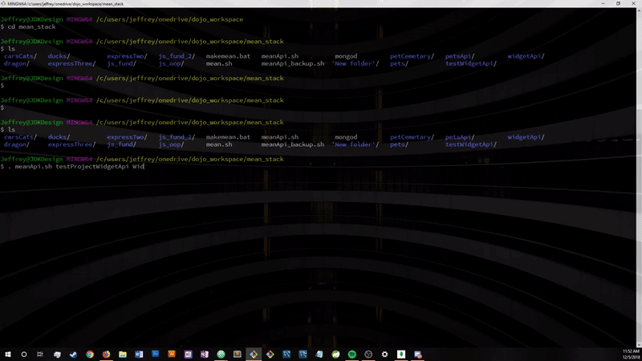

# meanApiGenerator
run from bash terminal\
.meanApi.sh PROJECTNAME MODELNAME modelnamelowercase\\
notes: Controller>MODELNAMEs.js line 13: $push is erased in the creation process. Add $push before :

